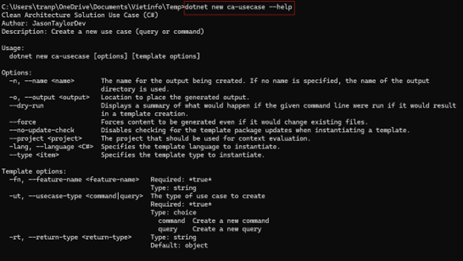
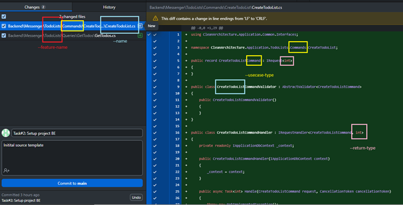

# Learn simple how to use cli

The following prerequisites are required to build and run the solution:

- .NET 8.0 SDK (latest version)
- Node.js (latest LTS, only required if you are using Angular or React)

The easiest way to get started is to install the .NET template:

```
dotnet new install Clean.Architecture.Solution.Template::8.0.5
```

## Syntax of command

All of it we start with base command named “ca-sln” it mean clean architect.

```
dotnet new ca-sln
```

Once install new project, you need to specify use client framework you want to use.

With this template for now only support:

- Angular
- React
- None Web API Only

## Shorthand:

- -cf –client-framework
- -o --output

To create a Single-Page Application (SPA) with Angular and ASP NET Core:

```
dotnet new ca-sln --client-framework Angular --output YourProjectName
```


_Figure 1 . SPA with Angular_

To create a SPA with React and ASP NET Core:

```
dotnet new ca-sln -cf React -o YourProjectName
```


_Figure 2. SPA with React_

To create a ASP NET Core Web API-only solution:

```
dotnet new ca-sln -cf None -o YourProjectName
```


_Figure 3. Web API only_

Launch the app with:

```
cd src/Web
dotnet run
```
To learn more, run the following command:

```
dotnet new ca-sln –help
```


_Figure 4. ca-sln --help_

With MediatR we have two condition to use:

* Command
* Queries

You can create use cases (commands or queries) by navigating to  **_./src/Application_** and running **_dotnet new ca-usecase._**

## Shorthand:

* -n --name (Name of Command or Query Folder)
* -fn –feature-name (Name of Feature aka Folder) Required
* -ut –usecase-type (Command/Query type) Required
* -rt –return-type (Return data type)

To create a new command:

```
dotnet new ca-usecase --name CreateTodoList --feature-name TodoLists --usecase-type command --return-type int
```


_Figure 5. Command usecase_

To create a query:

```
dotnet new ca-usecase -n GetTodos -fn TodoLists -ut query -rt TodosVm
```
To learn more, run the following command:

```
dotnet new ca-usecase --help
```


_Figure 6. ca-usecase –help_

# Database

The template is configured to use SQL Server by default. If you would prefer to use SQLite, create your solution using the following command:

```
dotnet new ca-sln --use-sqlite
```
Use this command you will switch Database into SQLite.

When you run the application the database will be automatically created (if necessary) and the latest migrations will be applied.

Running database migrations is easy. Ensure you add the following flags to your command (values assume you are executing from repository root)

* --project src/Infrastructure (optional if in this folder)
* --startup-project src/Web
* --output-dir Data/Migrations

For example, to add a new migration from the root folder:

```
dotnet ef migrations add "SampleMigration" --project src\Infrastructure --startup-project src\Web --output-dir Data\Migrations
```