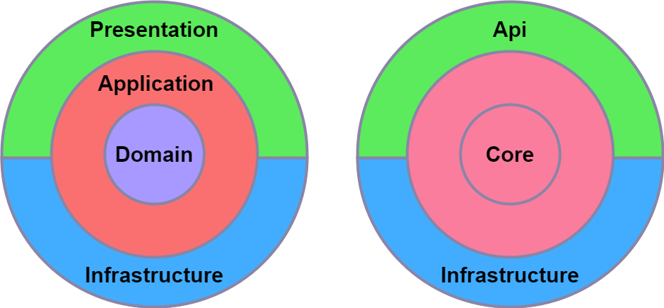

# [Common web application architectures](https://learn.microsoft.com/en-us/dotnet/architecture/modern-web-apps-azure/common-web-application-architectures)

There are various architectural approaches for building web applications, with the two most commonly used being monolith and layers.

## [What is a monolithic application?](https://learn.microsoft.com/en-us/dotnet/architecture/modern-web-apps-azure/common-web-application-architectures#what-is-a-monolithic-application)

## [All-in-one applications](https://learn.microsoft.com/en-us/dotnet/architecture/modern-web-apps-azure/common-web-application-architectures#all-in-one-applications)

## [What are layers?](https://learn.microsoft.com/en-us/dotnet/architecture/modern-web-apps-azure/common-web-application-architectures#what-are-layers)

## [Traditional "N-Layer" architecture applications](https://learn.microsoft.com/en-us/dotnet/architecture/modern-web-apps-azure/common-web-application-architectures#traditional-n-layer-architecture-applications)

## [Clean architecture](https://learn.microsoft.com/en-us/dotnet/architecture/modern-web-apps-azure/common-web-application-architectures#clean-architecture)

## [Organizing code in Clean Architecture](https://learn.microsoft.com/en-us/dotnet/architecture/modern-web-apps-azure/common-web-application-architectures#organizing-code-in-clean-architecture)
## [Application Core](https://learn.microsoft.com/en-us/dotnet/architecture/modern-web-apps-azure/common-web-application-architectures#application-core)
### [Application Core types](https://learn.microsoft.com/en-us/dotnet/architecture/modern-web-apps-azure/common-web-application-architectures#application-core-types)
* Entities (business model classes that are persisted)
* Aggregates (groups of entities)
* Interfaces
* Domain Services
* Specifications
* Custom Exceptions and Guard Clauses
* Domain Events and Handlers
## [Infrastructure](https://learn.microsoft.com/en-us/dotnet/architecture/modern-web-apps-azure/common-web-application-architectures#infrastructure)
### [Infrastructure types](https://learn.microsoft.com/en-us/dotnet/architecture/modern-web-apps-azure/common-web-application-architectures#infrastructure-types)
* EF Core types (, DbContextMigration)
* Data access implementation types (Repositories)
* Infrastructure-specific services (for example, or FileLoggerSmtpNotifier)
## [UI Layer](https://learn.microsoft.com/en-us/dotnet/architecture/modern-web-apps-azure/common-web-application-architectures#ui-layer)
### [UI Layer types](https://learn.microsoft.com/en-us/dotnet/architecture/modern-web-apps-azure/common-web-application-architectures#ui-layer-types)
* Controllers
* Custom Filters
* Custom Middleware
* Views
* ViewModels
* Startup
## [Monolithic applications and containers](https://learn.microsoft.com/en-us/dotnet/architecture/modern-web-apps-azure/common-web-application-architectures#monolithic-applications-and-containers)
## [Monolithic application deployed as a container](https://learn.microsoft.com/en-us/dotnet/architecture/modern-web-apps-azure/common-web-application-architectures#monolithic-applications-and-containers)
## [Docker support](https://learn.microsoft.com/en-us/dotnet/architecture/modern-web-apps-azure/common-web-application-architectures#docker-support)
## [Troubleshooting Docker problems](https://learn.microsoft.com/en-us/dotnet/architecture/modern-web-apps-azure/common-web-application-architectures#troubleshooting-docker-problems)
## [Other web application architectural styles](https://learn.microsoft.com/en-us/dotnet/architecture/modern-web-apps-azure/common-web-application-architectures#other-web-application-architectural-styles)
* [Web-Queue-Worker](https://learn.microsoft.com/en-us/azure/architecture/guide/architecture-styles/web-queue-worker)

* [N-tier ](https://learn.microsoft.com/en-us/azure/architecture/guide/architecture-styles/n-tier)

* [Microservice](https://learn.microsoft.com/en-us/azure/architecture/guide/architecture-styles/microservices)

## References – Common web architectures
* The Clean Architecture
https://blog.cleancoder.com/uncle-bob/2012/08/13/the-clean-architecture.html
* The Onion Architecture
https://jeffreypalermo.com/blog/the-onion-architecture-part-1/
* The Repository Pattern
https://deviq.com/repository-pattern/
* Clean Architecture Solution Template
https://github.com/ardalis/cleanarchitecture
* Architecting Microservices e-book
https://aka.ms/MicroservicesEbook
* DDD (Domain-Driven Design)
https://learn.microsoft.com/dotnet/architecture/microservices/microservice-ddd-cqrs-patterns/